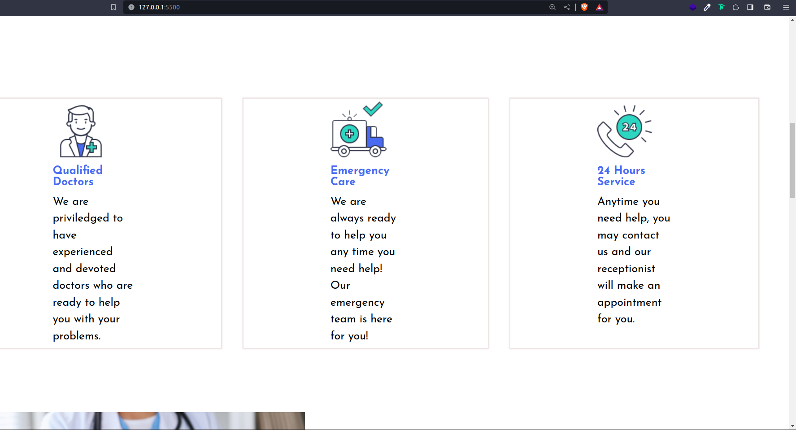

# Medic Care Project

---

## Project Description

---

- Medicare is a website for an innovative medical company that you can visit and learn more about the treatments and services offered there.

---

## live link

---

To access the project live use this link:
[https://larry6033.github.io/medic_care/]

## screenshot

---

This is how the website looks like

## Technologies used

---

- html
- css

## project setup and installation

1.Open the terminal and navigate to where you want to store the project eg.`cd Desktop` 2. To clone the project paste this on the terminal eg. `git clone https://github.com/larry6033/medicare.git ` 
3. Use `cd medical`to get into the project's folder. 
   4. Open the project in your favorite browser.
   ## contact
   ___
   If you would wish to get in contact with me for more infomation, feedback collaboration,reach out to this email; **larrymwimali@gmail.com**

## license
MIT License

Copyright (c) [**2024**] [***Larry Mwimali***]

Permission is hereby granted, free of charge, to any person obtaining a copy
of this software and associated documentation files (the "Software"), to deal
in the Software without restriction, including without limitation the rights
to use, copy, modify, merge, publish, distribute, sublicense, and/or sell
copies of the Software, and to permit persons to whom the Software is
furnished to do so, subject to the following conditions:

The above copyright notice and this permission notice shall be included in all
copies or substantial portions of the Software.

THE SOFTWARE IS PROVIDED "AS IS", WITHOUT WARRANTY OF ANY KIND, EXPRESS OR
IMPLIED, INCLUDING BUT NOT LIMITED TO THE WARRANTIES OF MERCHANTABILITY,
FITNESS FOR A PARTICULAR PURPOSE AND NONINFRINGEMENT. IN NO EVENT SHALL THE
AUTHORS OR COPYRIGHT HOLDERS BE LIABLE FOR ANY CLAIM, DAMAGES OR OTHER
LIABILITY, WHETHER IN AN ACTION OF CONTRACT, TORT OR OTHERWISE, ARISING FROM,
OUT OF OR IN CONNECTION WITH THE SOFTWARE OR THE USE OR OTHER DEALINGS IN THE
SOFTWARE.

